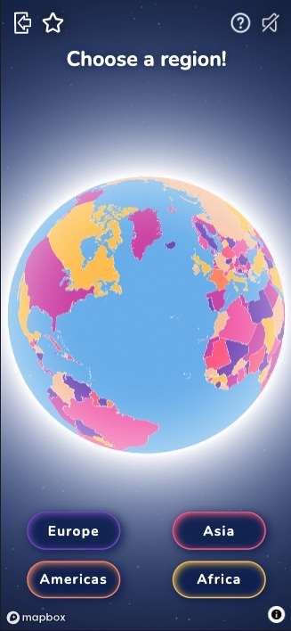

# map it! &#127758;

Interactive front-end game built for the web, written in ReactJS, utilising the [Mapbox GL JS API](www.mapbox.com).

---

## [View the live project here](https://map-it-aa424.web.app/)
---

> This project is a ReactJS version of an another [HTML-CSS-JavaScript project](https://github.com/szilvia-csernus/map-game), which I originally created for [Code Institute](www.codeintitute.net)'s Web Development Course.
  
Not for public use.
  
&copy; 2023 Szilvia Csernusne Berczes. All rights reserved.

---
 

# User Experience (UX)

## Site Owner's Goals

* The game should test the players' knowledge of the world's countries.
* The game should be visually appealing.
* It should give simple, clear instructions.
* The countries should be visually distinguishable.
* It should include animations to raise interest.
* It should be interactive.
* Player should be given feedback about the chosen country.
* High scores should be retained in the browser if settings allow.
* The game should look well and run on a wide range of devices.

## Players' Goals

* The game should be fun to play.
* Countries should be colourful and easy to recognise.
* The rules should be easy to follow.
* It should give feedback about the chosen country.
* It should retain high scores.
* The game should look well and run on a wide range of devices.

 

# Wireframes
 

Wireframes were created in [Balsamiq](https://balsamiq.cloud/).  

 

  

## Colour Scheme

Seven colours were needed to colour the countries on the map. I chose these vibrant colours to convey playfulness.
 
Colours for correct and incorrect feedback were chosen for their brightness to raise the player's attention.
  
Map colours: 

Background and feedback colours: 

  

## Typography

I selected the font named [Nunito](https://fonts.google.com/specimen/Nunito) from the [Google Fonts](https://fonts.google.com/) library for its simplicity and legibility yet fairly informal look.
  

## Map Style

**Mapbox** allows to custom style its maps in [Mapbox Studio](https://studio.mapbox.com/). I used the freely available [country-boundaries-v1](https://studio.mapbox.com/tilesets/mapbox.country-boundaries-v1) tileset and coloured the countries with the chosen colours with the help of the tileset's color-group property. This property makes sure that no adjacent countries will be coloured the same.
  

## Icons

The exit, info, checkmark, cross and star icons were all downloaded from [svgrepo](https://svgrepo.com/). Credits to individual icons are given in the [credits](#credits) section.  
For **favicons**, I created a small logo in [Figma](https://www.figma.com/) and used the [RealFaviconGenerator](https://realfavicongenerator.net/svg-favicon/) to convert it to favicons.

  

# Data

The main data source for this project is [Mapbox's country-boundaries-v1](https://studio.mapbox.com/tilesets/mapbox.country-boundaries-v1) tileset. The tileset's countries and territories are defined in the ISO 3166-1 country code standard, including alternate worldviews. I filter for some of the conflicting worldviews to avoid ambiguity. Data in this tileset is based on information obtained from officially recognized local or international entities. The displayed country boundaries and the identification of countries / territories are coming from this dataset.

  

# Functionality

## Landing Page

When visiting the first time, it takes a while (depending on network speed) to load all source code and tilesets from Mapbox. While waiting for loading, an animation is used to fill the time. Once the map is ready, it appears on the screen and the game can be started with the `PLAY` button.
  
 
 

  

## Instructions

The first time a user visits the site, an animation gives brief instructions on how to play the game. Later on, the animation will not show again but the instructions will be available when clicking the question mark icon in the top right corner. In case the user clears up the site's localStorage, the animation will show again as if they were visiting for the first time.

## Sounds

Another feature is the option to play with sounds. If the user clicks the `muted speaker` icon in the top right corner, the background music will start, as well as all sound effects will be enabled. The sounds can be muted any time by clicking the `active speaker` icon.

  

 

  

## Choosing a region

The first step in the game is to choose which region the player wants to test their knowledge on. Once chosen, an animation will bring the map closer to that region. The region's countries become selectable while all countries outside the region become blurred.
  

 

  

## Choosing a country

The player has to select the country that appears at the top. If the selection is correct, the country is coloured green and a green checkmark signals that the score has been registered. In case the selection is incorrect, the country becomes red and an animation flies the map to the correct country. This feedback allows the player to improve their knowledge.
  

 

  

## Scores

After 10 countries have been chosen, the score is displayed. For the first time, this is all the feedback the user is given. 
  

  
From the second round on, at the end of the round, a `View your best scores here` button appears which can be clicked to display the user's best scores. From this time on, the best scores can be reached anytime throughout the game via the star icon.  
 

  
The scores are stored in localStorage, so if the localStorage gets cleared, the highest scores would be lost.

## Error pages

Three types of error messages can be delivered to the user depending on the issue 
* a `Not Found` page in case of an invalid URL was typed in, 
* a `No Support` page in case the user uses an old browser that does not support Mapbox GL GS,
* an `Error page` an error page for other error scenarios including the failure to connect to the COUNT API as well as the Mapbox API. 
 

  

## Cross-platform usability

The game supports desktop, laptop, tablet and mobile phone device interactions. The first click on the `PLAY` button determines whether mouse/trackpad or touch interactions get enabled.  This differentiation was needed to allow multi-touch zooming and panning, tapping, double-clicking, click-and-panning as well as scroll zooming functionalities on the map. 

If the `PLAY` button was clicked with a mouse or trackpad: 
* a hovering effect is being applied, 
* double clicking / double tapping is required to select a country, 
* zooming in and out of the map as well as panning is available depending on the tool used: 
  - scrolling to zoom and grab-and-pan with a mouse, 
  - two-finger zoom and double-tap-pan with a trackpad.

If the `PLAY` button was clicked on a touch device:
* a firm tap or a slightly longer than usual (50ms long) tap is required to select a country.
* zooming in and out as well as panning the map is available in the usual ways:
  - zooming in and out with two or more fingers,
  - panning and rotating the map with sustained and moving touch with one or more fingers.

  

## Future Implementations

* There are many options to widen the game's functionality. Capital cities, flags and more regions - Australia, Oceania and Antarctica could be included as well as small islands and micro countries. Worldviews could be a dynamic feature depending on the location of the user. A new option with the US states could be part of the game too.

* Automatic testing with Cypress, to which support is provided by Mapbox. 
  

---

## Accessibility
 

* The font was chosen for having a simple design and clean contours to maximise legibility. 
* For font sizes, `rem` was used throughout the site to allow the text to scale according to the users' preferred default font size.
* The map can be zoomed in and out when the player has to find a country to cater for easier access.
* Images have `alt` labels and svg tags are marked with `aria` labels.
* Chrome Dev Tools' Lighthouse score is 100% for accessibility for both mobile and desktop devices. 

* [Mapbox Studio](https://studio.mapbox.com/) allows testing map designs for 8 types of visual impairments. The result of these tests can be found in [TESTING.md](./TESTING.md#accessibility).

  

---

# Technologies Used
 

## Language, Framework and Styling
 

The site was built with [JavaScript](https://en.wikipedia.org/wiki/JavaScript) using the [ReactJS](https://react.dev/) framework. Styling was achieved with React's built in CSS Modules.
  

## APIs, NPM packages, Libraries & Programs Used
 

* [Redux library vesrion ^8.0.5](https://redux.js.org/) - for state management

* [React Router DOM version ^6.10.0](https://reactrouter.com/en/main) - for routing

* [React Query version ^3.39.3](https://tanstack.com/query/v3/docs/react/overview) - for fetching data

* [use-sound npm package version ^4.0.1](https://www.npmjs.com/package/use-sound) - for playing audio in ReactJS

* [Mapbox GL JS API](www.mapbox.com)  - used for every map-based functionality.

* [Mapbox Studio](https://studio.mapbox.com/)  - to create map design.

* [Count API](https://github.com/szilvia-csernus/count-api)  - to keep track of the number of page loads.

* [EmailJS](https://www.emailjs.com/)  - to send updates about website usage.

* [Google Fonts](https://fonts.google.com/)  - for texts.

* [Balsamiq](https://balsamiq.cloud/)  - to create wireframes.

* [Figma](https://www.figma.com/)  - to create colour palette and image for favicons.

* [RealFaviconGenerator](https://realfavicongenerator.net/svg-favicon/)  - to generate favicons.

* [Multi Device Website Mockup](https://techsini.com/multi-mockup/index.php)  - to create site visuals for responsive design.

* [Gyazo](https://gyazo.com)  - for adding `.gif` files to this README file.

* [Git](https://git-scm.com/) & [Github](https://github.com/)  - for version control, safe storage and deployment.

* [VS Code](https://code.visualstudio.com/) - for the development environment.

* [Google Dev Tools](https://developer.chrome.com/docs/devtools/)  - for testing and troubleshooting.

---

  

# Local Development and Deployment

The project was created with create-react-app. See the generic documentation [here](CREATE-REACT-APP.md).

The project is deployed from the 'build' folder and hosted on [Firebase](https://firebase.google.com/).

It can be re-deployed with:

`npm run build`

`firebase hosting:disable`

`firebase deploy`
---

  

# Testing

Detailed testing processes are documented in [TESTING.md](TESTING.md).

---
  

# Credits

## Data

* Data for country centroids for displaying the names of the countries:
https://github.com/gavinr/world-countries-centroids/blob/master/dist/countries.geojson - MIT Licence, Copyright (c) 2021 Gavin Rehkemper

* Country info including region info:
https://github.com/annexare/Countries/blob/master/data/countries.json - MIT License, Copyright (c) 2014 Annexare Studio

 

## Icons
 

* Exit icon:
https://www.svgrepo.com/svg/170342/exit-hand-drawn-interface-symbol-variant

* Check icon:
https://www.svgrepo.com/svg/404945/check-mark

* Cross icon:
https://www.svgrepo.com/svg/470906/times

* Question mark icon:
https://www.svgrepo.com/svg/491697/question-circle

* Star icon:
https://www.svgrepo.com/svg/509256/star

* Sound icon:
https://www.svgrepo.com/svg/442013/sound

* Mute icon:
https://www.svgrepo.com/svg/441980/mute

 

## Audio

 

* Background music:
Carefree Kevin MacLeod (incompetech.com)
Licensed under Creative Commons: By Attribution 4.0 License
http://creativecommons.org/licenses/by/4.0/
 Music promoted on https://www.chosic.com/free-music/all/
 https://www.chosic.com/download-audio/25863/
* Alternative background music (currently not active):
Weekend by LesFM | https://lesfm.net/acoustic-background-music/
Music promoted by https://www.chosic.com/free-music/all/
Creative Commons CC BY 3.0
https://creativecommons.org/licenses/by/3.0/
 https://www.chosic.com/download-audio/29586/

* Correct choice sound effect:
Sound Effect by <a href="https://pixabay.com/users/liecio-3298866/?utm_source=link-attribution&amp;utm_medium=referral&amp;utm_campaign=music&amp;utm_content=132273">Liecio</a> from <a href="https://pixabay.com//?utm_source=link-attribution&amp;utm_medium=referral&amp;utm_campaign=music&amp;utm_content=132273">Pixabay</a>

* 'clink' sound:
Sound Effect from <a href="https://pixabay.com/?utm_source=link-attribution&amp;utm_medium=referral&amp;utm_campaign=music&amp;utm_content=6346">Pixabay</a>

* Incorrect choice sound effect:
Sound Effect from <a href="https://pixabay.com/?utm_source=link-attribution&amp;utm_medium=referral&amp;utm_campaign=music&amp;utm_content=6346">Pixabay</a>

* High score sound:
Sound Effect by <a href="https://pixabay.com/users/universfield-28281460/?utm_source=link-attribution&amp;utm_medium=referral&amp;utm_campaign=music&amp;utm_content=123742">UNIVERSFIELD</a> from <a href="https://pixabay.com/sound-effects//?utm_source=link-attribution&amp;utm_medium=referral&amp;utm_campaign=music&amp;utm_content=123742">Pixabay</a>

* Choose region sound:
Sound Effect from <a href="https://pixabay.com/sound-effects/?utm_source=link-attribution&amp;utm_medium=referral&amp;utm_campaign=music&amp;utm_content=14575">Pixabay</a>

* Play Button / New Game sound:
Sound Effect from <a href="https://pixabay.com/sound-effects/?utm_source=link-attribution&amp;utm_medium=referral&amp;utm_campaign=music&amp;utm_content=85688">Pixabay</a>

  

## Other credits - incorporated ideas and solutions
 

* Base code for rotating globe is adapted from [one of Mapbox's example codes](https://docs.mapbox.com/mapbox-gl-js/example/globe-spin/),
which I also reference in the code.

* Base code for hovering effect is adapted from [one of Mapbox's example codes](https://docs.mapbox.com/mapbox-gl-js/example/hover-styles/),
which I also reference in the code.

* For the intro animation I used ideas from:
https://css-tricks.com/animating-with-clip-path/ - animating with clip-path
https://www.youtube.com/watch?v=zadj2i5wUyc - animating with gradients by Colt Steele

* Adding drop-shadow filter to svg icons:
https://css-tricks.com/adding-shadows-to-svg-icons-with-css-and-svg-filters/

* Geolocation coordinate finder:
http://bboxfinder.com/

* Clamp() calculator for responsive font sizes:
https://grizhlie-clamp-calculator.netlify.app/

* Use of useQuery() from the react-query library:
https://tylerclark.dev/react-query/
https://blog.bitsrc.io/how-to-start-using-react-query-4869e3d5680d

  

##  Acknowledgements
 
I would like to thank the following contributors:

* [Chris Wong](https://github.com/chriswhong) from [Mapbox](www.mapbox.com) for giving guidance on the implementation of the Mapbox GL JS API through [Mapbox's dedicated discord channel](https://discord.com/invite/uMpcC5RmJh).

* [Tim Nelson](https://github.com/TravelTimN) and [Manuel Perez Romero](https://www.linkedin.com/in/manuel-perez-romero-460063176/) for giving useful feedback throughout the development and testing processes.

* My family and friends for taking the time to test the game.

* [Code Institute](www.codeintitute.net)'s Slack Community for continuous support.

  

##  Disclaimer
 
This project was created as a portfolio project. All parts of the project form the intellectual property of the developer.
  
Not for public use.
  
&copy;2023 Szilvia Csernusne Berczes. All rights reserved. 

